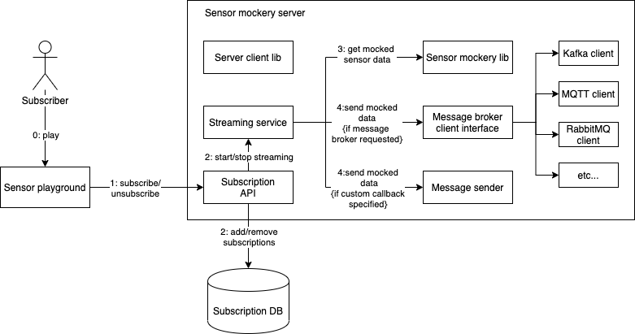
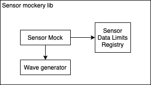

# Architectural overview

## Components

Sensor mockery is a system used to generate mocked sensor data. It can be consumed in two ways:
- by adding the `sensor mockery lib` in the code base of any embedded system.
- through the Internet via a `message broker` or with the `Server client lib` made especially for it.

### Sensor mockery lib

This is the core functionality of sensor mockery. It can be used to generate mocks of different sensors. The way it works is that first it generates waves of different types (sine, triangular, saw-tooth, etc.). Then the wave is passed through a `sensor-specific` filter normalizing the wave by making it appear like it's comming from the sensor. As a finishing effect some noise can also be applied.

`sensor mockery` lib is written in the `C` programming language making it usable across a lot of embedded systems.

#### Use cases

The most important use case is using it as a mocking utility when writing tests for embedded systems projects. It can also be used as a sensor replacement while developing.

### Sensor mockery server

It is a backend that makes use of the `sensor mockery` lib. The `sensor mockery` backend serves as a streaming service by sending sensor mock data to message brokers like `kafka`, `mqtt`, `rabbitmq`, etc. It also introduces a stream subscription mechanism which implies that once a stream is created multiple clients can subscribe for it and start accepting messages. Subscription happens when a client passes the URL of a message broker and specifies it's type.

There are three ways to interact with the `sensor mockery` server:
1. via it's graphical user interface which is like a DJ panel with different sensors
1. via the `server client` lib, which serves as a REST API client wrapper
1. via raw REST API calls

#### Use cases

IoT devices using `message brokers` to receive data can use it as a way to mock the data they receive. It can be using for acceptance/smoke tests and also for development purposes when no sensors are available.
